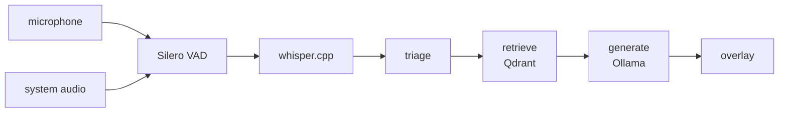

# 🫥 Invisible

> A local-first desktop overlay that listens to a conversation and streams model-written advice, hidden from screen capture.

**Invisible is a Windows Electron app that transcribes live audio with whisper.cpp, retrieves from your own notes in Qdrant, and streams answers from a local Ollama model onto a transparent overlay. Nothing leaves the machine: audio is never written to disk and the transcript is held in memory, capped at 40 turns.**

<!-- readme-header -->
     

## Before you use this

**Recording a conversation without the other party's consent is unlawful in two-party-consent jurisdictions**, including California, Washington, Illinois and most of the EU. The design reflects that: audio is never written to disk, the transcript lives only in memory, and one keystroke (`Ctrl+Shift+X`) stops capture, clears state and hides the overlay.

**Using this in a live interview is deception of the interviewer.** Most employers treat it as grounds for rescinding an offer, and some proctored platforms detect overlay or process anomalies. The software does not enforce that judgement; it is yours to make.

**What the capture exclusion does and does not do.** `setContentProtection` maps to `WDA_EXCLUDEFROMCAPTURE` on Windows. It defeats Zoom, Teams, Meet, OBS, Game Bar and PrintScreen. It does not defeat a phone camera pointed at the screen, and it does not hide the process from software that enumerates running executables.

## What it does

- Captures microphone and system audio, detects speech with Silero VAD, and transcribes with a whisper.cpp sidecar (`large-v3-turbo`).
- Decides whether an utterance is a question, retrieves matching chunks from your own markdown notes (Qdrant, `nomic-embed-text` embeddings), and streams an answer from an Ollama model (`qwen3.8:27b` by default) as a LangGraph pipeline: transcribe, triage, retrieve, generate.
- Tells speakers apart by which capture chain the audio arrived on, so no diarization model is needed. Your own speech is transcribed but never answered.
- Interview and meeting modes, answer styles (auto, bullets, spoken, brief), typed questions, answers from the clipboard, and OCR of the screen to answer what it asks.
- Exports meeting notes to `Documents\Invisible`.
- A Setup panel that probes each dependency and prints the command for anything missing. It never changes anything itself.

## Architecture



The main process (`src/main`) owns shortcuts, windows and the agent; the graph lives in `src/graph`, with whisper, Ollama and Qdrant clients under `src/whisper`, `src/ollama` and `src/qdrant`. The overlay and settings UIs are React, built with Vite.

## Requirements

| | |
|---|---|
| OS | Windows 11 x64 |
| GPU | NVIDIA, 12 GB VRAM or more. Developed on an RTX 4090 (24 GB). |
| Node | 24 or newer |
| Ollama | Installed on the host (default `http://127.0.0.1:11434`) |
| Docker | Docker Desktop, used only for the Qdrant container |
| Disk | Roughly 20 GB: whisper binary and model (about 2.3 GB), the answer model (about 17 GB per `src/main/config.js`), embedding model (274 MB) |
| Audio | Headphones. Through speakers the microphone re-captures system audio and remote speech is transcribed twice. |

## Quickstart

```bash
npm install                 # also vendors the VAD and ONNX assets
npm run services:up         # Qdrant container on 127.0.0.1:6333
npm run ollama:pull         # answer model (host Ollama)
npm run embed:pull          # embedding model
npm run fetch-whisper       # whisper binary + model
npm run dev
```

Then press `Ctrl+Shift+,` and read the Setup panel.

To ground answers in your own material, put markdown in `corpus/` and run `npm run ingest`. Write one idea per `##` section, since chunks split on headings (see `corpus/README.md`). Nothing in `corpus/` except its README is committed. Without a corpus the app still works; answers are less specific.

Tests (Node's built-in runner, run after `npm install`): `npm test`.

Installer: `npm run dist` builds an unsigned Windows installer (`release/`). It bundles app code only, so place `bin/` and `models/` beside the installed `Invisible.exe`, or run `npm run fetch-whisper` from a source checkout and copy them across. SmartScreen will warn on first run.

## Shortcuts

| Key | Action |
|---|---|
| `Ctrl+Shift+\` | Show / hide the overlay |
| `Ctrl+Shift+Enter` | Toggle click-through |
| `Ctrl+Shift+Space` | Answer the last question again |
| `Ctrl+Shift+K` | Clear the transcript |
| `Ctrl+Shift+X` | Panic: stop capture, clear, hide |
| `Ctrl+Shift+'` | Resume capture after panic |
| `Ctrl+Shift+Arrows` | Move the overlay |
| `Ctrl+Shift+O` | Jump the overlay to the next screen corner |
| `Ctrl+Shift+,` | Settings |
| `Ctrl+Shift+M` | Toggle interview / meeting mode |
| `Ctrl+Shift+/` | Type a question |
| `Ctrl+Shift+.` | Cycle answer style |
| `Ctrl+Shift+E` | Export meeting notes |
| `Ctrl+Shift+;` | Answer the text on the clipboard |
| `Ctrl+Shift+G` | OCR the screen and answer what it asks |

## Configuration

Read from the environment in `src/main/config.js`: `OLLAMA_HOST`, `INVISIBLE_MODEL`, `INVISIBLE_EMBED_MODEL`, `QDRANT_URL`. No `.env` file is needed.

## Project layout

```
src/main       Electron main process: shortcuts, windows, config, settings, export
src/audio      capture worker and VAD
src/graph      LangGraph pipeline (transcriber, triage, retriever, generator)
src/whisper    whisper.cpp sidecar client and queue
src/ollama     model client and prompts
src/qdrant     chunking, ingest, search
src/renderer   React overlay and settings UI
scripts        vendor copy, whisper fetch, corpus ingest, OCR, replay
corpus         your notes (git-ignored apart from its README)
docs           handbook.html
```

## Status

Personal project at version 0.1.0 for Windows only. The handbook (`docs/handbook.html`) reports about 673 ms from end of question to first visible word; that figure is prose in the handbook with no committed raw results, and the model configuration has changed since it was written, so treat it as indicative. No CI and no license file are present.
